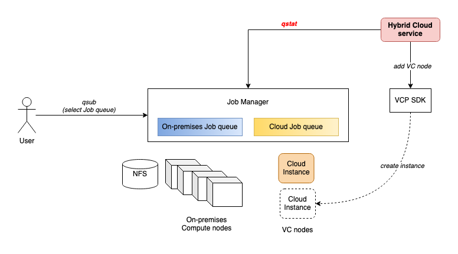

# 計算資源補完のためのテンプレート

## 概要

オンプレミスのバッチ型計算機システムの計算ノードが不足したとき、クラウド上に
オンプレミスシステムと同様のソフトウェア構成を持つ計算ノードを立ち上げ、
バッチシステムに組み込むことを想定した実装である。

以下の要件に対応する。

- インターフェースを抽象化し、複数種のバッチシステムに適用可能とする。
- 適用対象のバッチシステムは、開発時点では SLURM および Torque を想定する。
- 構築するクラウド上の計算ノードのソフトウェア環境は、オンプレミスと同じ
  ソフトウェア環境の VM イメージもしくはコンテナの利用を前提とする。
- 構築するクラウド上の計算ノードは、オンプレシステムとのファイル共有を前提とする。
- 開発時点では、以下の環境での動作を確認した。
  * クラウドプロバイダ: AWS, Azure
  * バッチシステム: SLURM
  * ファイル共有: NFS

## システム構成

計算資源補完のためのテンプレート機構は下記のようなシステム構成で実現する。

ここでは「Hybrid Cloud Service」と呼ぶ。



## 機能仕様

Hybrid Cloud Service の機能仕様は以下のとおりである。

1. ジョブ管理システムはオンプレミス上に存在し、オンプレミスの計算ノード群に
  加えてクラウドの計算ノードの追加・削除を自動的に行う。
2. オンプレミスの計算ノード群を使用するジョブキューと、クラウドの計算ノードを
   使用するジョブキューを分離する。
    * ユーザはジョブを投入する際にジョブキューを明示的に指定して使い分けるものとする。
3. クラウドの計算ノードは、Hybrid Cloud Service により必要に応じて、VCP SDK を
  用いて VC ノード作成要求を VC コントローラに対して実行する。
    * Hybrid Cloud Service はクラウド専用ジョブキューとジョブの実行状態を監視する。
    * クラウド専用ジョブキューにジョブが投入されたことを検知してVCノードを追加する。
    * 実行中と実行待ち状態のジョブが無ければVCノードを削除する。
4. クラウドの計算ノードは、起動時にオンプレミス側の共有ファイルシステム (e.g. NFS)
  をマウントして利用できる。
5. ジョブ管理システムの管理者は、クラウド専用ジョブキューに対応する計算ノード情報を
  事前に Hybrid Cloud Service に登録する。

## 詳細設計

### Hybrid Cloud Service のメイン制御

Hybrid Cloud Service は常駐プロセスとして起動し、クラウド専用ジョブキューの
ノード実行状況を定期的にジョブ管理システムに問い合わせる。

1. キューのノード実行状況を確認し、実行待ちジョブが1個以上あればノードを追加する。
2. 実行待ちジョブが1個も無い場合、 `CLEANUP_NODE_WAIT_TIME` 秒間だけ待機する。
3. 再度ノード実行状況を確認し、実行待ち、実行中ジョブがどちらも無い場合、
   全ノードを削除する。
4. 再度、1 の処理から繰り返す。

### VCP SDK を用いたノード追加、削除

Hybrid Cloud Service のメイン制御から呼ばれる VCP SDK を用いたノードの追加、削除
処理は、Docker コンテナ化された VCP SDK API を呼び出す方式で実行する。

#### ノード追加

- VCP SDK を使用し、環境変数 `VC_NAME` に指定した Unit Group に対して
  VC Node 1 個を含む Unit を作成 (create_unit) する。
- Unit の spec は環境変数 `PROVIDER_NAME`, `FLAVOR_NAME`, `IMAGE_NAME` から取得する。
- 起動したノード上で、計算クラスタの共有ファイルシステム (NFS) をマウントする。

#### ノード削除

- VCP SDK を使用し、環境変数 `VC_NAME` に指定した Unit Group に含まれるすべての
  VC Node を一括削除する。


### バッチシステムとのインターフェース

バッチシステムによりジョブキューのノード実行状況を問い合わせするコマンドや、
その出力内容は異なる。このため、Hybrid Cloud Service のメイン制御部から呼び出す
コマンドとして、バッチシステムごとに以下の Base スクリプト関数を実装する。

| 関数名        | 目的                   |
| ------------- |----------------------- |
| get_status    | キューのノード実行状況を取得し、実行待ちまはた実行中ジョブの個数を集計する |
| join_cluster  | 起動したノードでジョブを実行可能な状態にする |
| leave_cluster | シャットダウンするノードをクラスタから切り離す |
| check_version | 使用するジョブ管理コマンドが実行可能かどうかを確認する |


各関数の処理内容は、SLURM を例とした場合には以下のようになる。

**get_status**

1. `squeue` コマンドの実行結果を取得

    ```
    # e.g. squeue コマンド実行時出力:
    JOBID PARTITION     NAME     USER ST       TIME  NODES NODELIST(REASON)
       18     cloud   run.sh   ubuntu PD       0:00      1 (Resources)
       21     xxxxx   run.sh   ubuntu  R       0:00      1 (Priority)
       19     cloud   run.sh   ubuntu PD       0:00      1 (Priority)
       20     cloud   run.sh   ubuntu PD       0:00      1 (Priority)
       17     cloud   run.sh   ubuntu  R       0:50      1 c1
    ```

2. ジョブ実行待ち、実行中に対応する JOB STATE CODES を集計する。  
   SLURM の場合、PD=PENDING, R=RUNNING である。

    ```
    # e.g. squeue コマンド出力結果の集計:
    3 PD
    1 R
    ```
    
**join_cluster**

- 起動したノードの状態を "IDLE" 状態に更新する。
  * SLURM の場合、コントローラが当該ノードを計算ノードとして利用可能な状態になったことを
    検知するまでに数分程度を要するため、 `scontrol update` コマンドを用いて状態を強制的に
    更新する。

    ```
    sudo scontrol update node=$nodename state=idle
    ```

  * 利用するバッチシステムにより、この処理の要否は異なる。

**leave_cluster**

- シャットダウンするノードの状態を "DRAIN" 状態に更新する。
  * SLURM の場合、コントローラが当該ノードの停止を検知するまでに数分程度を要するため、
    `scontrol update` コマンドを用いて状態を強制的に更新する。

    ```
    sudo scontrol update node=$nodename state=drain reason=downing
    ```

  * 利用するバッチシステムにより、この処理の要否は異なる。

### クラウド計算ノード用 Base コンテナ構成

計算ノードは VCP SDK を用いて VC ノードとして起動する。
したがって、VCP の Base コンテナにバッチシステムの計算ノードとして必要な
ソフトウェアをインストールしておく。

#### SLURM 計算ノード用パッケージ、設定ファイル

詳細については `vcpsdk/sample/hybridcloud/docker/slurm/` 配下の Dockerfile 等を参照のこと。

- Ubuntu 18.04 LTS パッケージ
  * slurmd       (SLURM compute node daemon)
  * slurm-client (SLURM client side commands)

- 設定ファイル
  * `slurm.conf`
  * `munge.key`

- Base コンテナの ENTRYPOINT に追加するサービス  
  （現行の Base コンテナでは Supervisor サービスとして追加する）
  * `slurmd -D`
  * `munged -F`

## 利用手順

### 環境変数

- **必須項目**
  * 設定ファイル: `hybridcloud/vcpsdk/config/env`
  * `docker.env.example` を設定例としてコピー利用可

| 環境変数 | 説明 | 設定例 |
|------|----------------------|----|
| VCP_ACCESSKEY | VCP REST API アクセストークン |  |
| VC_NAME  | 計算ノードが作成される VCP Unit Group 名 | `hybridcloud` |
| PROVIDER_NAME | VCP クラウドプラグイン名 | `aws` |
| FLAVOR_NAME | VCP クラウドプラグインの Flavor 名 (vcp_flavor.yml の項目に対応) | `small` |
| IMAGE_NAME | 計算ノードに利用する Base コンテナイメージ | `10.0.0.1:5001/vcp/base:ubuntu18.04-slurm` |
| NFS_MOUNT_POINT | 計算ノードからのNFSマウントポイント (server:/directory) | `172.30.2.194:/export` |


- **オプション項目**
  * 以下の環境変数は `hybridcloud/scripts/hybrid-cloud-agent.sh` にデフォルト値が設定されている。
  * 変更が必要な場合、起動時の環境変数として上書きする。

| 環境変数 | デフォルト値 | 説明、設定例 |
|------|-----|---------------------------|
| CLEANUP_NODE_WAIT_TIME | `600` | 実行待ち、実行中ジョブが無い場合に全ノードを削除するまでに待機する時間 (単位: 秒) |
| VCP_SDK_CONTAINER_IMAGE | `vcpsdk:20.10.0` | VC ノード追加・削除のために使用されるコンテナ化された VCP SDK のイメージ名 |
| QUEUE_NAME | `cloud` | バッチシステムのクラウド専用ジョブキューの名前 (SLURM PARTITION 名、Torque QUEUE 名に対応) |
| NFS_LOCAL_DIR | `/mnt` | 計算ノードで NFS マウントする際のローカルディレクトリ |

### クラウドの計算ノード情報登録

クラウド上に追加する計算ノードの「IP アドレス:ホスト名」のペアを設定ファイルに記述する。

- 設定ファイル (JSON形式) : `hybridcloud/vcpsdk/config/hosts.json`
- ここで記述したエントリ数が計算ノードとして確保する最大台数となる。
- ジョブ管理システム側にも必要に応じて同様のエントリを設定する。(slurm.conf など)

hosts.json 記述例:

```
{
  "172.30.2.101": "c1",
  "172.30.2.102": "c2",
  "172.30.2.103": "c3",
  "172.30.2.104": "c4"
}
```

### VCP SDK 設定

計算ノードのホスト名を DNS 登録しない環境で使用する場合、VCP SDK の機能を用いて
計算ノードの `/etc/hosts` ファイルにホスト名のデータベースを自動作成することができる。

- 設定ファイル (YAML形式) : `hybridcloud/vcpsdk/config/vcp_config.yml`
- spec_options > add_host 項目に記述する

vcp_config.yml 記述例: (対象部分の抜粋)

```
spec_options:
    add_host:
       - "master:172.30.2.194"
       - "c1:172.30.2.101"
       - "c2:172.30.2.102"
       - "c3:172.30.2.103"
       - "c4:172.30.2.104"
```

### VCP SDK Docker コンテナ作成

1. `vcpsdk/hybridcloud/vcpsdk/` ディレクトリに VCP 東京データセンター証明書ファイル
  `tokyo_ca.crt` を配置する。

2. docker build コマンドを実行する。
    * (注) コンテナ内には config ディレクトリ以下の設定ファイル群は含めないこと。

    ```
    docker build -t vcpsdk:20.10.0 .
    ```

### Hybrid Cloud Service 起動、停止方法

1. systemd 設定

    ```
    cp vcpsdk/hybridcloud/scripts/hybrid-cloud.service /etc/systemd/system/
    systemctl enable hybrid-cloud
    ```

2. サービス起動

    ```
    systemctl start hybrid-cloud
    ```

3. サービス停止

    ```
    systemctl stop hybrid-cloud
    ```
