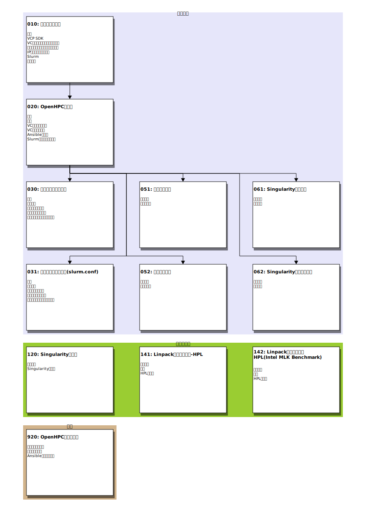

# README

---

VCP SDKを用いてクラウド上にOpenHPC環境を構築します。

## 概要

[OpenHPC](https://openhpc.community/)で配布しているパッケージを利用してクラウド上にHPC環境を構築します。

### 構成について

ここで構築する環境は１つのマスターノード（ヘッドノード）と複数の計算ノードによって構成されます。
マスターノードはNFSサーバとしての役割も担います。NFSによってホームディレクトリやOpenHPCのファイルを計算ノードとの間で共有します。

OpenHPCではジョブスケジューラとして[Slurm](https://www.schedmd.com/)と[PBS Professional](http://www.pbspro.org/)が選択できますが、ここではSlurmを使用します。

### 構築方法について

OpenHPCのInstall guideでは[Warewulf](http://warewulf.lbl.gov/)などを用いて計算ノードのプロビジョニングを行っていますが、ここでは Warewulf などのソフトウェアを利用しません。マスターノードや計算ノードにはVCP SDKを用いてクラウド上に作成した仮想サーバを利用します。同様にNFS用の仮想ディスクもVCP SDKによって作成します。VCP SDKが作成する仮想サーバ、仮想ディスクのことを、ここではVCノード、VCディスクと呼びます。

#### VCノードの作成

VCノード（クラウド上の仮想サーバ）を作成するには、このNotebook環境に用意されているVCP SDKを利用します。VCP SDKはNotebook環境から利用できるPython3のライブラリで、パブリッククラウド上(AWS, Azure, ...)に仮想サーバや仮想ディスクを作成するなどの操作が行えます。

実際のクラウドに対する操作はVCP SDKが直接行うわけではなくVC Controllerと呼ばれるVCPのサーバが実行しています。VC Controllerの機能をNotebook環境から直接利用することも可能ですが、利用しやすいようにまとめたライブラリが VCP SDKになります。VC Contorollerを利用するには、アクセストークンが必要となります。同様にVCP SDKを利用する場合も、VC Controllerのアクセストークンが必要となります。VCP SDKによる操作を行うために、事前にVC管理者に対してアクセストークンの発行を依頼しておいてください。

#### VCノードのイメージ選択

VCPでは利用者に対して、異なるクラウド(AWS, Azure, ...)の仮想サーバを同一の環境として提供するために[Docker コンテナ](https://www.docker.com/)を利用しています。クラウド上のVM/BMをVCノードとして組み入れる際にVCPが各VM/BMの上で共通環境となるコンテナを起動します。ここでは、このコンテナのことをBaseコンテナと呼びます。Baseコンテナは仮想サーバのモニタリングなどのVCノードに共通する機能を提供するための役割も担っています。

標準のBaseコンテナは共通環境を提供することを目的としていますが、それとは別に特定の利用目的を持ったBaseコンテナを
アプリケーションテンプレートでは提供しています。OpenHPC向けには、マスターノード用Baseコンテナイメージと計算ノード用Baseコンテナイメージを用意しています。ここでは、それらのコンテナイメージを利用します。

#### VCディスクの作成

VCディスク（クラウド上の仮想ディスク）もVCノードと同様にVCP SDKを利用することで作成できます。

現在VCディスクを作成できるプロバイダは `AWS` と `Azure` に限定されています。その他のプロバイダでOpenHPC環境を構築することを考慮して、このアプリケーションテンプレートではマスターノードにNFS用ディスクを作成しない構成にも対応しています。NFS用ディスクを作成しない場合は仮想ノードのルートボリュームを直接利用するので、ルートボリュームサイズに大きめの値を指定してください。

### バージョン

このNotebookが構築するミドルウェア、OSのバージョンを以下に示します。

* OpenHPC 1.3.9
* CentOS 7.7

## Notebookの一覧

お手本Notebookの一覧を示します。

**注意** :

お手本Notebookへのリンクを示す箇所がありますが、リンク先のNotebookは参照用となっていて**そのままでは実行できません**（Notebook自体は実行できてしまいますが、パスなどが想定しているものと異なるため正しく処理できずエラーとなります）。

次のどちらかの手順で作業用Notebookを作成する必要があります。

1. [000-README.ipynb#作業用Notebookの作成](000-README.ipynb#作業用Notebookの作成)で作業用のNotebookを作成する。
1. お手本Notebookを配置してある `notebooks/` から、`README.md`と同じディレクトリにNotebookをコピーする。

###  Notebookの関係図

各お手本Notebookの関係を示す図を以下に示します（画像をクリックすると拡大表示します）。図に表示される１つのブロックが１つのNotebookに対応しています。

### Notebookの目次

各お手本Notebookの目次を示します。リンクが表示されている項目が一つのNotebookに対応しています。

* [010: パラメータ設定](notebooks/010-パラメータ設定.ipynb)
    1. 概要
        - VCP SDKを用いてクラウド上に仮想サーバを作成し、OpenHPC環境の構築を行います
    1. VCP SDK
        - VCP SDKを利用する際に必要となるパラメータを設定します
    1. VCノードに共通するパラメータ
        - マスターノード、計算ノードに共通するパラメータを指定します
    1. 構築環境に割り当てるリソース量
        - 各VCノード、VCディスクに割り当てるリソース量を指定します
    1. IPアドレスとホスト名
        - 各ノードに設定するIPアドレスとホスト名を指定します
    1. Slurm
        - Slurmに関連するパラメータを指定します
    1. チェック
        - 設定項目漏れがないことを確認します
* [020: OpenHPCの起動](notebooks/020-OpenHPCの起動.ipynb)
    1. 構成
        - このNotebookが構築する環境の構成を図に示します
    1. 準備
        - このNotebookを実行するための準備作業を行います
    1. VCディスクの作成
        - マスターノードのNFSサーバが公開するファイルを配置するためのディスクを作成します
    1. VCノードの起動
        - マスターノード、計算ノードとして利用するVCノードを起動します
    1. Ansibleの設定
        - VCノードをAnsibleで操作するための設定を行います
    1. Slurmの状態を確認する
        - 起動したVCノードで実行されているSlurmの状態を確認します
* [030: 設定ファイルの編集](notebooks/030-設定ファイルの編集.ipynb)
    1. 概要
        - このNotebookではVCノードの設定ファイルを編集し、その結果を各VCノード配布する手順を示します
    1. 前提条件
        - このNotebookを実行するための前提条件を満たしていることを確認します
    1. パラメータの設定

    1. 設定ファイルの編集
        - OpenHPC環境の設定ファイルを取得して、Jupyter Notebookの編集機能を用いて設定ファイルを編集します
    1. 編集した設定ファイルの反映
        - 編集したファイルをVCノードに配置して、設定ファイルの変更内容をコンテナに反映させます
* [031: 設定ファイルの編集 -- slurm.conf](notebooks/031-設定ファイルの編集-slurm_conf.ipynb)
    1. 概要
        - このNotebookでは、VCノードの`slurm.conf`の内容を変更し、その変更を反映する手順を示します
    1. 前提条件
        - このNotebookを実行するための前提条件を満たしていることを確認します
    1. パラメータの設定

    1. 設定ファイルの編集
        - OpenHPC環境の設定ファイルを取得して、Jupyter Notebookの編集機能を用いて設定ファイルを編集します
    1. 編集した設定ファイルの反映
        - 編集したファイルをVCノードに配置して、設定ファイルの変更内容をコンテナに反映させます
* [051: ユーザの追加](notebooks/051-ユーザの追加.ipynb)
    1. 前提条件
        - このNotebookを実行するための前提条件を満たしていることを確認します
    1. ユーザ登録
        - OpenHPC環境にユーザを登録します
* [052: ユーザの削除](notebooks/052-ユーザの削除.ipynb)
    1. 前提条件
        - このNotebookを実行するための前提条件を満たしていることを確認します
    1. ユーザ削除
        - OpenHPC環境のユーザを削除します
* [061: Singularityのロード](notebooks/061-Singularityのロード.ipynb)
    1. 前提条件
        - このNotebookを実行するための前提条件を満たしていることを確認します
    1. 設定変更
        - Singularityをデフォルトで利用できるようにするために `/etc/profile.d/` の設定ファイルを変更します
* [062: Singularityのアンロード](notebooks/062-Singularityのアンロード.ipynb)
    1. 前提条件
        - このNotebookを実行するための前提条件を満たしていることを確認します
    1. 設定変更
        - Singularityをデフォルトではロードされないようにするために `/etc/profile.d/` の設定ファイルを変更します
* [120: Singularityの利用](notebooks/120-Singularityの利用.ipynb)
    1. 前提条件
        - このNotebookを実行するための前提条件を満たしていることを確認します
    1. Singularityの実行
        - singularityで docker コンテナイメージを実行してみます
* [141: Linpackベンチマーク -- HPL](notebooks/141-Linpackベンチマーク-HPL.ipynb)
    1. 前提条件
        - このNotebookを実行するための前提条件を満たしていることを確認します
    1. 準備
        - HPLを実行するための準備作業を行います
    1. HPLの実行
        - HPLを実行します
* [142: Linpackベンチマーク -- HPL -- Intel MLK Benchmark](notebooks/142-Linpackベンチマーク-HPL-Intel_MLK.ipynb)
    1. 前提条件
        - このNotebookを実行するための前提条件を満たしていることを確認します
    1. 準備
        - HPLを実行するための準備作業を行います
    1. HPLの実行
        - HPLを実行します
* [920: OpenHPC環境の削除](notebooks/920-OpenHPC環境の削除.ipynb)
    1. パラメータの指定
        - 削除を行うのに必要となるパラメータを入力します
    1. 構築環境の削除
        - 構築したOpenHPC環境を削除します
    1. Ansible設定のクリア
        - 削除した環境に対応するAnsibleの設定をクリアします
